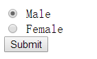
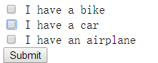

# form

### label标签

<label> 标签为 input 元素定义标注（标记）。

label 元素不会向用户呈现任何特殊效果。不过，它为鼠标用户改进了可用性。如果您*在 label 元素内点击文本，就会触发此控件*。就是说，当用户选择该标签时，浏览器就会自动将焦点转到和标签相关的表单控件上。

<label> 标签的**for 属性应当与相关元素的 id 属性相同**。

```html
<form>
  <label for="male">Male</label>
  <input type="radio" name="sex" id="male" />
  <br />
  <label for="female">Female</label>
  <input type="radio" name="sex" id="female" />
</form>
```

### input类型

text、password、submit、reset

button:定义可点击的按钮，但没有任何行为。button 类型常用于在用户点击按钮时启动 JavaScript 程序。

radio:定义单选按钮。单选按钮允许用户选取给定数目的选择中的一个选项。



```html
<input type="radio" name="sex" value="male" /> Male
<input type="radio" name="sex" value="female" /> Female
```

checkbox:定义复选框。复选框允许用户在一定数目的选择中选取一个或多个选项。



```html
<input type="checkbox" name="vehicle" value="Bike" /> I have a bike
<input type="checkbox" name="vehicle" value="Car" /> I have a car
<input type="checkbox" name="vehicle" value="Car" /> I have an airplane
```

hidden:隐藏字段对于用户是不可见的。隐藏字段通常会存储一个默认值，它们的值也可以由 JavaScript 进行修改。

image:<input type="image" /> 定义图像形式的提交按钮。必须把 src 属性 和 alt 属性与 <input type="image"> 结合使用。

file:用于文件上传。

###### 新类型：email、url、tel、search、number、range

### textarea

```html
<textarea rows="4" cols="50" autofocus>
定义多行的文本输入控件。文本区中可容纳无限数量的文本，其中的文本的默认字体是等宽字体（通常是 Courier）
</textarea>
```

autofocus：自动获取焦点

disabled：禁用该文本区

form=“form_id” 规定所属表单

maxlength：最大字符数

requied:必填

readonly：只读

尺寸用CSS的width和height控制

### select和datalist在制作下拉菜单时区别

- select的下拉菜单是供用户选择的，用户只能选择其中的选项不能自己添加。

- datalist不仅可以供用户选择，用户还可以自己输入，而且datalist还可以达到模糊匹配的效果。

- <datalist>标签必须与 input 元素配合使用该元素，来定义 input 可能的值。用input元素的list属性来帮顶datalist。

- 而<select>不与input标签配合。

```
  <input type="text" name="city1" id="city" list="citylist" placeholder="QingDao">
  <datalist id="citylist">
     <option value="QingDao">QingDao</option>
     <option value="DaLian">DaLian</option>
     <option value="YanTai">YanTai</option>
     <option value="WeiHai">WeiHai</option>
     <option value="QinHuangdao">QinHuangdao</option>
  </datalist>
```


